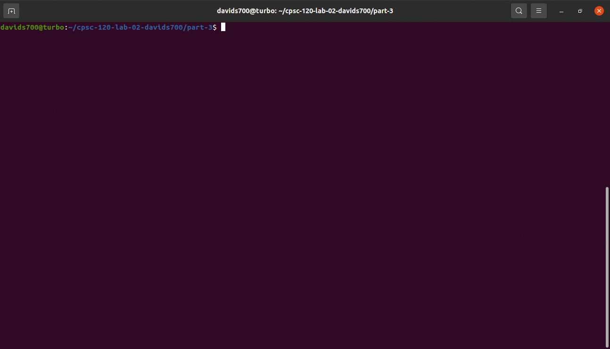
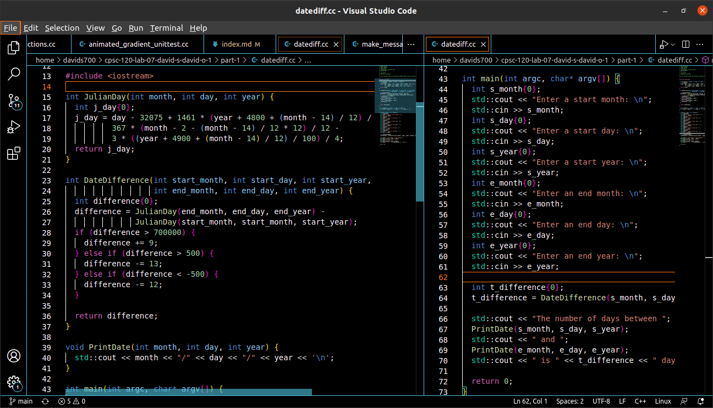

# Hello World

This is my home page! My name is David Solano and I am a student at [Cal State Fullerton](http://www.fullerton.edu/) with a major in Computer Science with a minor in economics.

## Computer Science Projects

My GitHub page is http://github.com/DavidJSolano.

### CPSC 120

* Lab 2

    Lab 2 was one of my favorite labs because it provided me crucial insight into utilizing Git/Github. Through this lab, I became knowlegable of the essential commands of git clone, add, and push. Aside from learning Git, I honed my C++ syntax in lab 2 part 1, in which we were required to debug the program so that it was readable to humans and machines. During lab 2 part 3, I successfully wrote, ran, and compiled my first-ever program that printed “Hello World!” which left me with an exhilarating feeling!
    

* Lab 7

    Lab 7 was one of the most important labs because it involved the implementation of functions. This lab allowed us to grasp how to properly utilize functions, and it made programming much less redundant than I thought it initially was going to be! To be more specific, in part 1 of this lab, I edited the body of many functions and manipulated the parameters in such a manner that the program returned the difference between 2 input dates. The second part of this lab had me change functions to simulate a game of Blackjack, given that we type in characters of the face cards or integers as arguments.
    

* Lab 11

    Another one of my favorite labs was 11, in which I was able to cement my understanding of object-oriented programming– a programming concept that I find very interesting. Within part 1 of this lab, we were required to utilize constructors, change member functions, and understand how inheritance works through public and private members of a class. Part 2 of this lab consisted of us creating a guessing game, in which the user has to guess the correct number; however, in coding up the program we once again used object-oriented programming.
    